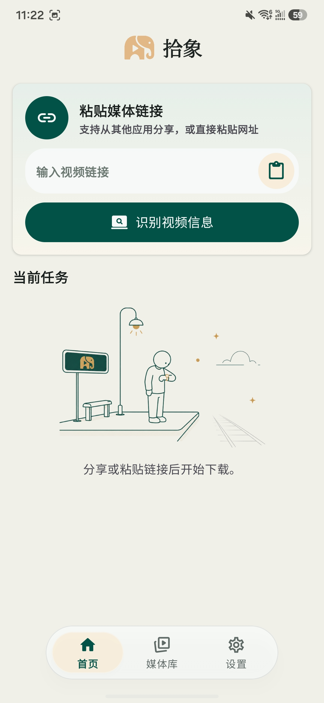
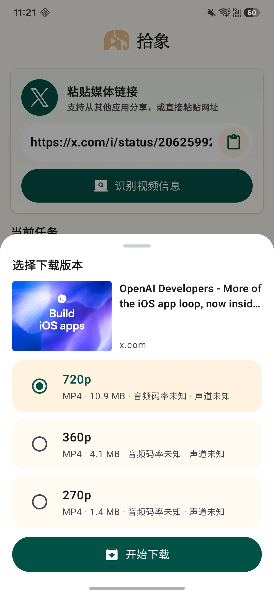
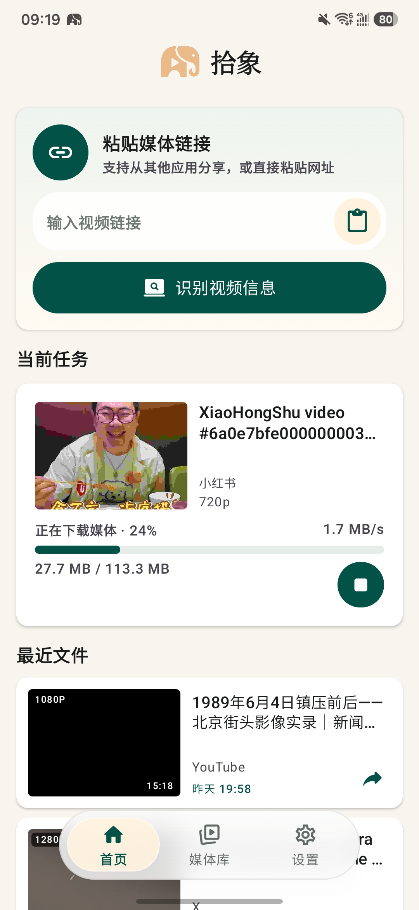
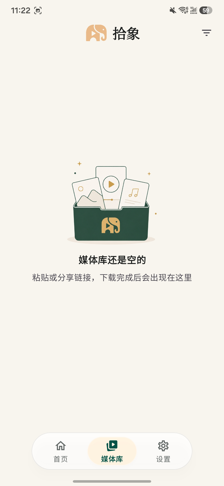

# 拾象

拾象是一个本地优先的 Android 媒体下载器。它接收来自系统分享菜单或手动输入的链接，在设备本地使用 `yt-dlp` 和 FFmpeg 解析、下载、校验并管理媒体文件。

“拾象”取自“拾取影像”：从散落在不同平台的链接里拾起你有权保存的影像。同时它也是 app 形象的谐音梗，让工具属性之外多一点容易记住的性格。

> 本项目只用于下载你有权访问和保存的内容。使用者需要自行遵守目标网站服务条款、版权规则和所在地法律。

## 截图

<p>
  
  
  
  
</p>

<p>
  
  
  
  
</p>

## 功能

- 从 Android 分享菜单接收文本链接。
- 手动输入 URL 并解析可用清晰度。
- 后台下载、通知进度、队列状态和失败原因提示。
- 本地媒体库、缩略图、播放进度和内置播放器。
- 支持保存到系统相册、系统分享、外部应用打开。
- 针对需要登录态或页面播放捕获的场景，提供内置 WebView 辅助流程。
- Cookie、下载历史和媒体文件保存在设备本地。

## 功能说明

### 链接识别

首页支持从其他应用分享链接，也可以直接粘贴 URL。应用会识别来源平台，并尝试解析标题、封面、时长、清晰度和文件体积等信息。

### 清晰度选择

解析完成后，拾象会展示可下载版本。你可以在不同清晰度和文件大小之间选择，再开始下载。

### 下载任务

下载过程在应用内显示实时进度、速度、已下载体积和总大小，并通过后台服务保持任务运行。失败时会尽量给出更具体的原因。

### 媒体库

下载完成的文件会进入本地媒体库，按卡片展示封面、清晰度、来源平台、时间和时长，方便回看、查找和继续操作。

### 分享与本地操作

媒体文件可以保存到系统相册、调用系统分享、用外部应用打开，也可以直接分享到常用应用。

### 批量管理

媒体库支持选择多个文件并批量删除，适合定期清理本地下载内容。

## 支持范围

应用底层基于 `yt-dlp`，可解析的平台会随 `yt-dlp` 能力变化。当前界面针对常见来源做了更好的展示和流程处理，包括 YouTube、Bilibili、TikTok/抖音、小红书、微博、Instagram、Threads、X/Twitter 等。

有些平台会频繁调整接口、风控、登录态或 CDN 授权，可能出现解析失败、403、验证码、标题/封面不完整等情况。应用会尽量给出可操作的错误提示，但不承诺所有链接都能下载。

## 技术栈

- Kotlin
- Jetpack Compose + Material 3
- AndroidX Media3
- Chaquopy
- yt-dlp
- yt-dlp-ejs
- FFmpeg for Android
- Coil

## 开发方式

本项目全程通过 vibecoding 方式完成：需求、界面、实现、调试和文档主要由自然语言驱动的 AI 编程协作迭代产生。代码仍按正常 Android 工程维护，欢迎用 issue 和 pull request 继续改进。

## 构建

### 环境要求

- Android Studio
- JDK 17
- Android SDK 35
- Python 3.10+，供 Chaquopy 构建阶段使用

如果 Python 不在默认 PATH，可以通过 Gradle 属性或环境变量指定：

```bash
./gradlew :app:assembleDebug -Pchaquopy.python=/path/to/python3
```

或：

```bash
CHAQUOPY_PYTHON=/path/to/python3 ./gradlew :app:assembleDebug
```

### 编译

```bash
./gradlew :app:assembleDebug
```

只做 Kotlin 编译验证：

```bash
./gradlew :app:compileDebugKotlin
```

## 项目结构

```text
app/src/main/java/com/pixelpoint/mediadownloader/   Android UI、下载服务、设置和媒体库
app/src/main/python/media_engine.py                 yt-dlp 封装与平台辅助逻辑
app/src/main/assets/licenses/                       第三方二进制许可说明
app/src/main/jniLibs/arm64-v8a/                    预编译 FFmpeg 执行库
```

## 隐私

应用没有自建服务器。URL、Cookie、下载历史和媒体文件默认保存在本机。详见 [PRIVACY.md](PRIVACY.md)。

## 贡献

欢迎提交 bug report、平台兼容性修复、错误提示改进和 UI 优化。提交前请阅读 [CONTRIBUTING.md](CONTRIBUTING.md)。

## 第三方声明

本项目依赖多个开源组件，并包含预编译 FFmpeg 二进制。详见 [NOTICE.md](NOTICE.md)。

## 许可证

本项目采用 Apache License 2.0。详见 [LICENSE](LICENSE)。
